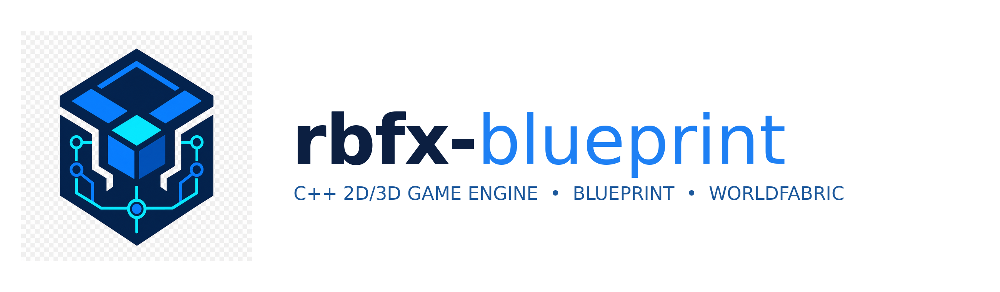

# rbfx-blueprint

<p align="center">
  
</p>

**rbfx-blueprint** is **version 0.7.0-production**, a **C++17 2D and 3D game engine and framework** based on the [rbfx](https://github.com/rbfx/rbfx) fork of [Urho3D](https://github.com/urho3d/Urho3D). It preserves the control of a code-first engine while adding an integrated production toolchain: an extensible editor, Blueprint visual graphs, the typed rbscript gameplay language, rendering and content tools, correlated diagnostics, and semantic orchestration through **World Fabric**.

[](https://github.com/robert-sarah/rbfx-blueprint/actions/workflows/build.yml)

> **Project status:** production-foundation release `0.7.0-production`. The repository contains the P0–P6 foundations, the 0.7.0 production-finalization layer, deterministic ProductionReadiness gates, a native Windows/macOS CI matrix, bounded soak and performance gates, and a documented editor smoke workflow. Platform certification still requires the native runners, display sessions, GPU drivers and release hardware to complete the evidence.

## Vision

rbfx-blueprint brings three production layers into one engine:

| Layer | Role | Integration |
| --- | --- | --- |
| **C++** | Runtime, rendering, physics, networking, tools, and native extensions | Shares the rbfx reflection API with the other layers |
| **Blueprint** | Visual graphs for gameplay, logic, tools, and production | Reflected nodes, subgraphs, comments, search, and editor integration |
| **rbscript** | Typed gameplay language with brace-based syntax | Designed to use the same rbfx reflection system as C++ and Blueprint |
| **World Fabric** | Cross-system semantic graph | Connects resources, dependencies, builds, simulation, profiling, networking, and production |

## World Fabric: the project differentiator

**World Fabric** is the engine's semantic dependency graph. It does not represent files only: each node can describe a scene, asset, shader, Blueprint graph, script, build task, simulation, or runtime system. Dependencies are persisted in JSON resources and can be analyzed, ordered, profiled, and queried from the editor.

This architecture connects cause and effect across the production pipeline. A resource change can be traced to its consumers, invalidated tasks, temporal events, and CPU/GPU costs. Associated runtime services include transitive impact analysis, semantic queries, correlated profiling, deterministic simulation, and versioned collaboration operations.

## Available features

### P0 — Editor foundations

The P0 layer establishes a consistent editor experience: a shared visual system, docking, workspaces, a command palette, autosave and recovery, Asset Browser, Inspector and Outliner filters, common UI contracts, and associated automated tests.

### P1 — Integrated production pipeline

The following editors and resources are available on the `blueprint-foundation` branch:

| Domain | Features |
| --- | --- |
| **Rendering** | **Shader Graph** resource and editor |
| **Effects** | **VFX Graph** resource and editor |
| **Audio** | **Audio Mixer** resource and editor |
| **Animation and cinematics** | **Sequencer** resource and editor |
| **Build** | **Build Dashboard** and deterministic build resource |
| **World** | Production inspectors for Terrain, TileMap2D, and NavigationMesh |
| **Multiplayer** | **Multiplayer Profile**, startup settings, replication, and diagnostics |
| **Resource routing** | Dedicated extensions registered through `StandardFileTypes` |

These components provide editor contracts, JSON persistence, validation, and integration points for a broader production toolchain. They do not yet replace a complete certification matrix for Windows, macOS, Linux, mobile, WebAssembly, and consoles.

### P2 — World Fabric and correlated production

The P2 layer includes:

| Service | Capabilities |
| --- | --- |
| **Dependency Explorer** | Node and edge editing, inspection, and build ordering |
| **Impact Analysis** | Transitive impact propagation through the graph |
| **Semantic Query** | Search by node type, tags, and metadata |
| **Correlated Profiler** | Correlation between graph nodes and runtime measurements |
| **Semantic Timeline** | Association between World Fabric nodes and Sequencer timeline events |
| **Incremental Scheduler** | Visualization of invalidation and task state by node |
| **Deterministic Reproduction** | Snapshot history, restore, replay, and reproduction workflows |
| **Collaboration** | Known clients, locking, operations, revisions, and synchronization diagnostics |

The P2 panels are integrated into `WorldFabricTab` and use runtime services from `Source/Urho3D/WorldFabric/` rather than isolated interface-only data.

### P3 — Ecosystem and extensible foundations

The P3 layer extends World Fabric beyond the editor and provides contracts for distributed production:

| Service | Delivered capabilities |
| --- | --- |
| **PluginRegistry and PluginSDK** | Versioned manifests, capabilities, dependencies, cycle detection, deterministic activation order, ABI versioning, reflection/Blueprint/rbscript/editor callbacks, and reproducible digests |
| **DistributedPackageRegistry** | Package registry, semantic version resolution, replication plans, controlled replacements, JSON persistence, and stable digests |
| **WorldFabricRealtimeSession** | Multi-user presence, Lamport clock, ordered envelopes, acknowledgements, and active-client tracking |
| **RbScriptLspService** | LSP/JSON-RPC protocol, document open/update, diagnostics, completion, hover, go-to-definition, rename, and rbfx reflection integration |
| **InteractiveDocumentation** | Page and symbol index, search, Markdown/HTML rendering, type-registry import, and JSON serialization |
| **IncrementalScheduler** | Transitive invalidation, dependency propagation, cycle detection, ready tasks, and deterministic digests |
| **ContentAddressedCache** | Content-addressed artifact cache, SHA-256/FNV-1a digests, revisions, and versioned replacement |
| **GameplayTestHarness** | Deterministic callback execution, stable ordering, seeds, frame limits, results, digests, and shared-library ABI-safe test utilities |
| **HotReloadStateStore** | Runtime field capture/restoration, hot-reload generations, validation, removal, and stable digests |
| **Native CI** | `blueprint-native-validation` job covering Linux, Windows MSVC x64, and macOS arm64/x64 in GitHub Actions |

The coherent editor-enabled Linux build now records **418/418 CTest tests passing**. Phase 6, phase 9, phase 10, the model-import contracts, package provenance and native target validation add targeted coverage for reproducible asset-cache manifests, deterministic terrain authoring, hardened Shader Graph validation, case-insensitive model extensions, strict import request validation, LOD/texture/provenance task schemas, insertion-order-independent BuildGraph digests, deterministic model profile round trips, effective model-profile participation in AssetImportSettings JSON, cache hashes and importer rejection, reproducible package-manifest provenance, architecture compatibility, and platform-specific texture compression. The model import contract is documented in [`ModelImportProfile.md`](Documentation/ModelImportProfile.md), package provenance in [`PackageManifestProvenance.md`](Documentation/PackageManifestProvenance.md), the target matrix in [`NativeTargetMatrix.md`](Documentation/NativeTargetMatrix.md), and the editor brief implementation audit in [`EditorBriefImplementationAudit.md`](Documentation/EditorBriefImplementationAudit.md). Coverage includes negative cases for deterministic branches, malformed JSON, duplicates, causal detachment, cache invalidation, terrain settings, shader parameter references, empty source data, missing cooked outputs, mismatched importer profiles, incomplete cooking metadata, unsafe model units/UV/LOD settings, invalid embedded model profiles, unsupported native combinations, and stable digest computation. The workflows `blueprint-native-validation` and `production-validation` prepare native Windows and macOS configuration, compilation and test execution. The latter also compiles the Editor on all desktop runners and runs a bounded Linux/Xvfb graphical smoke test; optional native GUI smoke runs are available through manual dispatch.

### Native target and compression matrix

`PlatformExportAdapter` now exposes a deterministic export matrix for Linux, Windows, macOS, WebAssembly, Android and iOS. It validates the architecture and texture compression together before packaging, serializes the selected compression into the build profile and package manifest, and includes that value in the canonical provenance digest. The supported combinations are documented in [`NativeTargetMatrix.md`](Documentation/NativeTargetMatrix.md). This contract prevents a package from silently selecting an architecture or texture format that its target backend cannot consume; it does not claim that a Linux CI runner has executed native graphics certification for every platform.

### Unique production extensions

The following three services extend World Fabric beyond a dependency graph and are integrated into `WorldFabricTab`:

| Extension | Professional capability |
| --- | --- |
| **Causal World Fabric Debugger** | Captures sequenced causal evidence, analyzes dependency chains, summarizes causes, computes impacted nodes, and supports manual diagnosis from a selected node. |
| **Universal Deterministic Time Machine** | Provides bounded multi-domain history, per-frame states and inputs, restoration, replay, investigation branches, frame comparison, and first-divergence search between branches. |
| **Semantic Build Capsule** | Stores a canonical JSON capsule containing environment data, World Fabric/Time Machine digests, semantic inputs, and plugins, with validation, deterministic fingerprints, and build-to-build diffing. |

These services are designed as reusable runtime contracts for the editor, CI, profiler, networking, and support tools. They provide a foundation for traceability and reproduction; they do not by themselves constitute complete production certification or automatic capture of every engine subsystem.

### Competitive multiplayer focus

The project now has a deliberate competitive scope: **deterministic indie/AA multiplayer with rollback**, not breadth parity with Unity, Unreal Engine, or Godot. `DeterministicSimulation`, `RollbackManager`, `UniversalDeterministicTimeMachine`, and the executable `TestCompetitiveDemo` form the primary proof chain from fixed-step state to delayed-input reconciliation, digest diagnostics, JSON replay persistence, and exact 1v1 convergence.

| Competitive pillar | Delivered contract | Evidence and limits |
| --- | --- | --- |
| **Rollback netcode** | Ordered bounded prediction, authoritative reconciliation, digest comparison, and transport-independent resynchronization | [`CompetitiveNetcode.md`](Documentation/CompetitiveNetcode.md), network tests, and 1v1 demonstration; the manager does not pretend to be a socket or matchmaking service |
| **Temporal debugging** | Branches, replay, frame diff, first-divergence search, and validated JSON import/export | [`DeterministicTimeMachine.md`](Documentation/DeterministicTimeMachine.md); game-specific long-term storage remains a project decision |
| **RbScript and Blueprint** | Workspace-aware LSP, cross-file symbols/references, reflection completion, and bidirectional bridge tests | [`RbScriptLsp.md`](Documentation/RbScriptLsp.md) and [`CompetitivePlayer.rbscript`](Examples/RbScript/CompetitivePlayer.rbscript) |
| **2D/3D parity** | Shared scene contracts plus an orthographic XY profile, world grid, persistent snapping, and constrained 2D gizmo | [`SceneView2D.md`](Documentation/SceneView2D.md); specialized tilemap and sprite-authoring tools are not implied |

The complete mission statement and conservative release criteria are documented in [`CompetitiveMission.md`](Documentation/CompetitiveMission.md). The branch is intended to be judged by reproducible match evidence, divergence reports, replay agreement, and native platform validation rather than by an unbounded feature checklist.

### P5 — Open world runtime and multi-viewport authoring

The P5 delivery adds deterministic runtime contracts for large persistent worlds and a Godot-style scene authoring layout:

| Domain | Delivered capability |
| --- | --- |
| **Streaming** | Budget-aware open world scheduler integrated with `WorldPartition`, including deterministic prioritization and memory estimates |
| **Visibility** | Conservative distance and field-of-view occlusion culling for registered world proxies |
| **Vegetation** | Seed-stable cell-local vegetation generation with reproducible instance transforms |
| **Navigation and LOD** | Per-cell navigation readiness and character LOD selection with hysteresis and culling thresholds |
| **Gameplay persistence** | Quest definitions and progress, versioned JSON world saves, runtime capture/restore, and deterministic validation |
| **Environment** | Weather state transitions, day/night progression with daylight projection, and spatial audio zones with distance falloff |
| **Editor** | Switchable single viewport or four independently rendered Perspective, Top, Front, and Right panes; the active pane supports focus, panning, and orthographic zoom |

The gameplay services are composed through `OpenWorldGameplayRuntime`, allowing streaming, weather, time of day, quests, saves, and spatial audio to advance together without making the individual services depend on editor state. The implementation is intentionally exposed as engine contracts so a production game can connect real asset loading, navigation baking, audio buses, and persistence backends around deterministic core behavior.

### Gameplay production and project profiles

The gameplay production layer adds reusable C++17 runtime contracts for the systems commonly required by a complete game project. Inventory definitions are stack-aware and weight-bounded; equipment swaps are transactional; dialogue nodes support gated choices and persistent flags; skill trees enforce prerequisites and deterministic point spending; and economy offers perform atomic buy and sell operations with explicit currencies.

| Domain | Delivered capability |
| --- | --- |
| **Gameplay data** | Item definitions, inventory stacks, weight limits, equipment slots, skill ranks and prerequisites |
| **Narrative** | Dialogue nodes, branching choices, required flags, granted flags and terminal states |
| **Economy** | Integer balances, multi-currency offers, stock limits and atomic transactions |
| **Advanced AI** | Priority-based stimulus selection with radius, strength, TTL and deterministic tie-breaking |
| **Character animation** | One state-machine facade for sprite 2D, skeletal 3D and hybrid animation profiles |
| **VFX** | Bounded deterministic instances supporting 2D sprite, 3D particle and hybrid effects |
| **UI runtime** | Anchored widgets, visibility, text updates, z-order hit testing and 2D/3D overlay compatibility |
| **Content authoring** | Registry, compatibility validation, deterministic manifests and editor recognition of gameplay asset extensions |

`GameplayProjectProfile` makes the separation explicit. A **2D profile** enables Physics2D and sprite-oriented animation/VFX while disabling 3D lighting, 3D physics and 3D navigation. A **3D profile** enables 3D physics, navigation, lighting and skeletal animation while disabling Physics2D by default. A **Hybrid profile** enables both domains and is intended for 2.5D games, 3D worlds with 2D gameplay layers, or projects that deliberately combine sprite and skeletal content.

The separation is enforced at content-registry validation time: a 2D-only profile rejects 3D assets, a 3D-only profile rejects 2D assets, and a hybrid profile accepts both. Standard editor file analysis recognizes `.inventory`, `.equipment`, `.dialogue`, `.skilltree`, `.economy`, `.aiprofile`, `.animationprofile`, `.vfx`, `.ui`, `.gameplay2d`, `.gameplay3d`, and `.gameplayhybrid` as JSON-editable production assets.

The Linux validation for this delivery contains the production gameplay tests, including inventory, equipment, dialogue, skills, economy, advanced AI, 2D/3D animation, VFX, UI, content compatibility and deterministic manifest cases. Competitive additions are covered by dedicated rollback, replay, LSP, and 1v1 demonstration tests. The latest production contracts are documented in [`Documentation/ProductionFinalization.md`](Documentation/ProductionFinalization.md) and the release gates are documented in [`Documentation/ProductionReadiness.md`](Documentation/ProductionReadiness.md).

### P6 — Production finalization 0.7.0-production

The finalization layer adds twenty explicit, testable production gates and authoring services: native validation evidence, deterministic soak runs, CPU/GPU/frame/memory budgets, frame history with P95 metrics, animation retargeting, blend graphs, cinematic timelines and shot lists, 2D/3D/hybrid asset import validation, dependency and export manifests, visual UI styles and anchored layout, reproducible package manifests, desktop target matrices, crash recovery, input action maps, screenshot regression digests, state-aware resource hot reload and build provenance ledgers.

### P6.1 — Editor and asset pipeline hardening

The phase 6 delivery adds three production-facing extensions. [`TerrainAuthoring`](Documentation/TerrainAuthoring.md) provides deterministic brush falloffs, quantized height stamping, bounded heightfields and stable digests; `WorldFabricTab` exposes those operations through an authoring panel with an inspectable preview. [`AssetPipeline`](Documentation/AssetCacheManifest.md) now persists and restores a deterministic content-cache manifest with duplicate and dependency validation. [`ShaderGraph`](Documentation/ShaderGraphProduction.md) now rejects multiple output nodes and unresolved parameter references, validates texture parameter declarations, and emits the required HLSL `SamplerState` alongside texture uniforms. [`EditorProductionValidation`](Documentation/EditorProductionValidation.md) validates production workspace state, 2D/3D scene mode exclusivity, autosave safety, recovery warnings, Blueprint/RbScript readiness and asset-database readiness with stable diagnostics and digests.

The published phase 6 commits are `7a35573` for asset-cache manifests, `77da649` for terrain authoring, and `680a9aa` for Shader Graph validation and HLSL samplers. Phase 9 hardens import requests in `ad138b5`; phase 10 adds BuildGraph cooking schemas in `3730cd2`; phase 11 adds editor production validation in `deb2923`. These are engine contracts and editor foundations; they do not claim that FBX import, terrain baking, GPU shader compilation or platform packaging are already complete commercial pipelines.

The new [`production-validation.yml`](.github/workflows/production-validation.yml) workflow configures and tests Linux, Windows and macOS, compiles the Editor on all three desktop runners, and runs a bounded graphical smoke test under Linux/Xvfb. A manual native GUI mode is available for hosted Windows/macOS runners, but release-grade graphical certification still requires a display-capable native machine and the target GPU drivers.

The final version is intentionally described as a **production foundation**, not as a claim that every external SDK, GPU driver, installer signer, console kit or project-specific asset pipeline has been certified. This distinction keeps the release evidence reproducible and honest. The runnable desktop distribution contract, including the mandatory `CoreData` and `EditorData` directories, is documented in [`Documentation/RuntimePackaging.md`](Documentation/RuntimePackaging.md).

## Repository architecture

```text
Source/
├── Urho3D/
│   ├── Blueprint/       Visual graph runtime and reflection
│   ├── RbScript/        rbscript language and compilation
│   ├── WorldFabric/     Semantic graph, open world runtime, simulation, profiling, and plugins
│   ├── Graphics/        Rendering, RenderGraph, and graphics resources
│   ├── Network/         Networking runtime and multiplayer profiles
│   └── ...              C++ rbfx/Urho3D subsystems
├── Editor/
│   ├── Foundation/      Production editor tabs and contracts
│   └── ...              Editor applications and extensions
└── Tests/               Catch2 v3 tests for resources and services
```

C++ files in the main source directories are discovered automatically by the existing CMake configuration. Production resources follow rbfx conventions for loading, JSON persistence, reflection, and validation.

## Requirements

Primary development uses **C++17**, **CMake**, **Ninja**, and a compiler compatible with GCC 13 or an equivalent toolchain. On Linux, the usual OpenGL, Vulkan, X11, DBus, and system graphics dependencies must be available. Third-party engine dependencies are managed by the repository and its CMake configuration.

## Build and test on Linux

From the repository root:

```bash
cmake -S . -B build -G Ninja \
  -DURHO3D_TESTING=ON \
  -DURHO3D_EDITOR=OFF \
  -DURHO3D_PLAYER=OFF \
  -DURHO3D_CSHARP=OFF

cmake --build build --target Tests -j2
ctest --test-dir build --output-on-failure
```

To build the Linux editor in Debug mode:

```bash
cmake -S . -B build-editor -G Ninja \
  -DCMAKE_BUILD_TYPE=Debug \
  -DURHO3D_EDITOR=ON \
  -DURHO3D_PLAYER=OFF \
  -DURHO3D_TOOLS=OFF \
  -DURHO3D_TESTING=OFF \
  -DURHO3D_CSHARP=OFF

cmake --build build-editor --target Editor -j2
```

The validated Linux editor build in this branch produces `build-editor/bin/Debug/Editor`. The test build produces the Catch2 binary under `build/bin/`, depending on the CMake configuration.

## Portability

The rbfx base targets desktop environments and uses a portable CMake architecture. Complete validation must nevertheless be distinguished from theoretical build capability:

| Platform | Documented status on this branch |
| --- | --- |
| **Linux x86_64** | Configuration, test suite, and editor compilation validated in the development environment |
| **Windows** | Configuration is present; native execution and graphical smoke testing remain to be performed |
| **macOS** | Configuration is present; native macOS smoke testing remains to be completed |
| **Android, iOS, WebAssembly, consoles** | Adapters and validation matrices remain subject to the available toolchains |

Contributions that add a platform should provide a configuration command, a reproducible build, and a native smoke test when the user interface is involved.

## Contributing

Contributions must follow the C++17 conventions and rbfx/EASTL containers used by the project. New resources should define stable persistence, negative validation, a digest where appropriate, and a Catch2 test. Editor extensions should follow `ResourceEditorTab` contracts, use the existing undo mechanisms, and avoid passing const pointers to mutable ImGui fields.

Before opening a pull request, run at least `git diff --check`, the `Tests` target, and the Editor build when modifying `Source/Editor/`. Build artifacts such as `build/` and `build-editor/` must not be committed.

## License and provenance

rbfx-blueprint is distributed under the MIT License. The project is derived from rbfx and Urho3D; upstream copyright notices are preserved in [LICENSE](LICENSE). Contributions specific to rbfx-blueprint are attributed to the authors and contributors of this fork.

## Links

| Resource | Link |
| --- | --- |
| rbfx-blueprint repository | [github.com/robert-sarah/rbfx-blueprint](https://github.com/robert-sarah/rbfx-blueprint) |
| Current development branch | [`blueprint-foundation`](https://github.com/robert-sarah/rbfx-blueprint/tree/blueprint-foundation) |
| Upstream rbfx project | [github.com/rbfx/rbfx](https://github.com/rbfx/rbfx) |
| Upstream Urho3D project | [github.com/urho3d/Urho3D](https://github.com/urho3d/Urho3D) |
| License | [LICENSE](LICENSE) |

## Production readiness

`ProductionReadiness` adds explicit evidence gates for diagnostics, sanitizer and fuzzing campaigns, long-run soak, native desktop validation, reproducible builds, plugin ABI manifests, dependency and license audits, 2D/3D/hybrid reference projects, documentation coverage and release packaging. These gates make missing evidence visible instead of presenting a contract test as a platform certification. The CI workflow also records reproducible-build provenance and runs Linux ASan/UBSan production contracts.

The recommended 1.0 exit criteria are documented in [`Documentation/ProductionReadiness.md`](Documentation/ProductionReadiness.md), while competitive validation evidence is summarized in [`Documentation/CompetitiveReleaseEvidence.md`](Documentation/CompetitiveReleaseEvidence.md). The supported desktop matrix must be confirmed on real Windows, Linux and macOS machines with the target graphics drivers before claiming final platform certification.

## Maturity status

rbfx-blueprint now has a substantially broader editor and production foundation than a minimal prototype: resources are persisted, interface contracts are tested, World Fabric provides a cross-system semantic layer, and the P3/P4/P5/P6 runtime and editor foundations are present. The coherent Linux build now records **403/403 CTest tests passing** after phase 10 BuildGraph cooking-plan hardening. Full industrial-production qualification still requires load testing, reference projects, native Windows/macOS validation, broader user documentation, and long-duration stability campaigns. The recorded competitive evidence is summarized in [`CompetitiveReleaseEvidence.md`](Documentation/CompetitiveReleaseEvidence.md).

## References

1. [rbfx repository](https://github.com/rbfx/rbfx)
2. [Urho3D repository](https://github.com/urho3d/Urho3D)
3. [GitHub Actions documentation](https://docs.github.com/en/actions)
